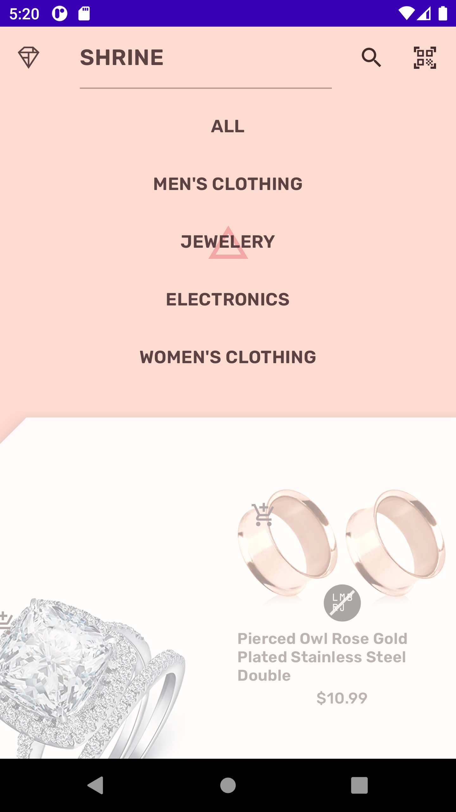
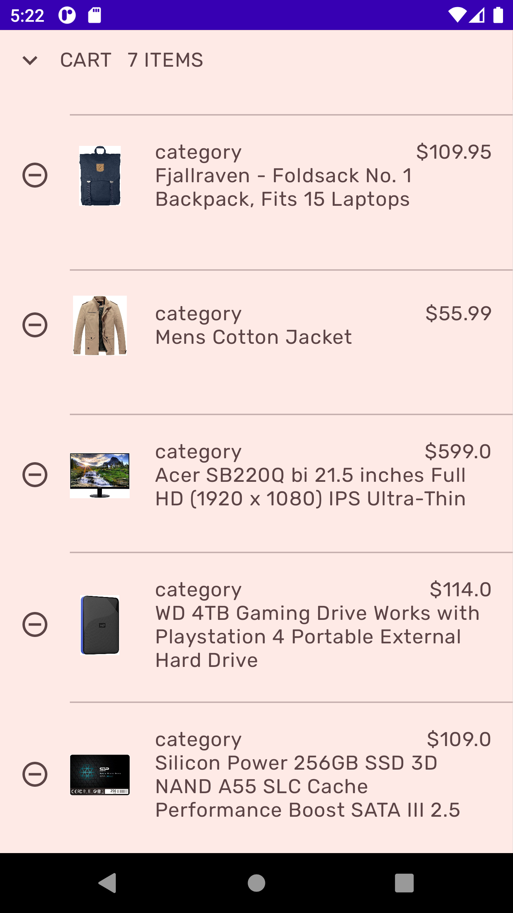
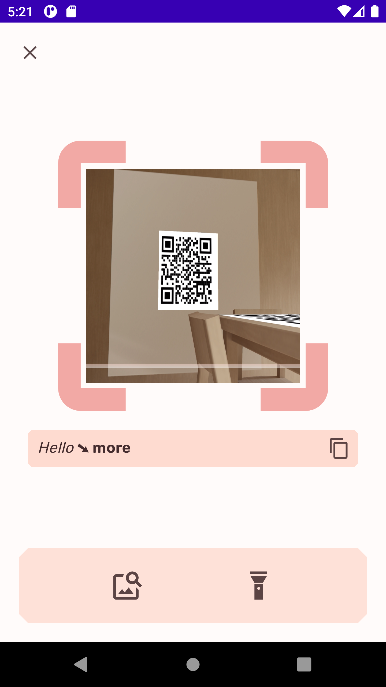
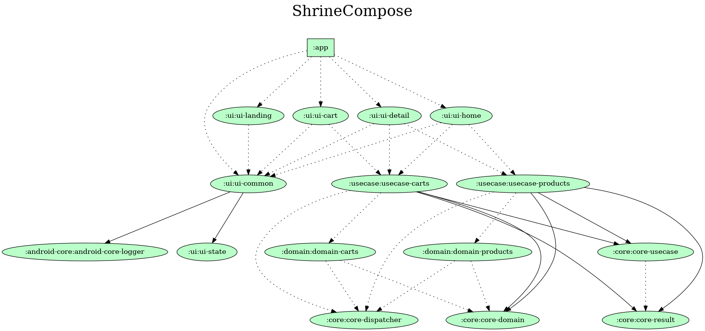

# Shrine Compose

The app based on [Shrine Material Design](https://material.io/design/material-studies/shrine.html)
with some modifications.

The main purpose of this project is a template structure for the Android project with my experience
and studying Jetpack Compose. So some features may not be implemented yet.

## Development

* UI written in [Jetpack Compose](https://developer.android.com/jetpack/compose).
* Built 100% in Kotlin and
  uses [Kotlin Coroutines](https://kotlinlang.org/docs/reference/coroutines/coroutines-guide.html).
* [Hilt](https://dagger.dev/hilt/) for dependency injection.
* Images are shown using [Coil](https://coil-kt.github.io/coil/).
* [Retrofit2 & OkHttp3](https://github.com/square/retrofit)
* Use [fakestoreapi](https://fakestoreapi.com) to get products.

## :camera_flash: Screenshots

| Home                                           | Menu                                           | Cart                                           | Qr                                           |
|------------------------------------------------|------------------------------------------------|------------------------------------------------|----------------------------------------------|
|  |  |  |  |

## Gradle Dependencies Graph

* ui-xx modules: contain all App UI components
* android-core-xx modules: contain all android core utilities needed for Application
* core-xx modules: contains auxiliary code required for several Ui and UseCase modules
* usecase-xx modules: contains all app use cases to communicate between ui and domain modules
* domain-xx modules: used to communicate to api endpoint, local storage...

## MAD Score

